# **Getting started with PAMGuard for marine mammal classification**

## **PAMGuard installation**

- PAMGuard is an opensource software (download [here](https://www.pamguard.org/download.php?id=118)).

- Select the appropriate version to download, according to your Operating System and the desired release of the software. Make sure to also install the required (or higher) java version.

- This guide/tutorial was performed on Ubuntu 20.04.4 LTS using the [2.02.02 version](https://www.pamguard.org/downloadpage.php?id=115) of the PAMGuard software and java 17.0.2.

- **Pro tip**: Launching PAMGuard presented with some issues (`Graphics Device initialization failed for :  es2, sw`) that were traced back to some JavaFX broken packages. The problem was resolved by uninstalling java 17.0.2 and reinstalling it via the [Zulu JDK FX package](https://www.azul.com/downloads/?version=java-17-lts&os=linux&architecture=x86-64-bit&package=jdk-fx#download-openjdk).

## **Launching PAMGuard**

- To start PAMGuard, unzip the PAMGuard software download, browse inside the folder where the executable `jar` file resides, open a terminal and execute it as `java -Xms384m -Xmx1024m -Djava.library.path=lib64 -jar PamguardBeta-2.02.02.jar` (for Windows just doubleclick on the shortcut created after installation).

- Close the `PAMGuard Tip of the day` dialogue.

- In the `Load PAMGuard configuration` dialogue, browse to select a valid `.psfx` settings configuration file to load an existing project (e.g. `PamTutorial1.psfx` from the official PAMGuard [user tutorial](https://www.pamguard.org/cms/files/pamguard_training_tutorial_v1_4_05_sep2020.pdf) project) or create a new `.psfx` file for a brand new project.

- Close the `Set PC Clock` dialogue.

- If the window analysis is not satisfying, adjust it via the menu bar `Help->Set Display Scaling Factor` and restart PAMGuard.
  
- Browse the menu bar and select `File->Show Data Model`. A new window that summarizes the data model of the project, i.e. the PAMGuard plug-ins that are utilized and the way that they are connected, pops up. The data model is derived from the `.psfx` file. For an already existing project, the data model is loaded from the corresponding `.psfx` file and consists of the PAMGuard modules, connections and settings that the project was last ran with. For a brand new project, the data model is created along with the new `.psfx` file and contains only an `Array Manager` module. The data model is enriched via the creation of PAMGuard modules/plug-ins, e.g. detectors, fft engines, classifiers and user displays. The `.psfx` file can be saved from the menu bar via `File->Save Configuration`. That way, it can be reloaded at a later time, so that the data model and overall setting of the project are retrieved efficiently.

References:
1. https://www.pamguard.org/cms/files/pamguard_training_tutorial_v1_4_05_sep2020.pdf, EX 2.1, EX 2.2, pages 6-7
   
## **Bioacoustic pattern detection with PAMGuard**

The detection of patterns in bioacoustic signals is crucial for the task of classifying marine mammals according to their acoustic recordings. PAMGuard is equipped with a number of plug-ins for the detection of patterns in bioacoustic signals. The two main underwater vocalizations that are going to be examined in this tutorial are clicks and whistles, detected in acoustic signals by the popular `Click Detector` and `Whistle and Moan Detector` PAMGuard plug-ins, respectively. Study the official [PAMGuard user tutorial](https://www.pamguard.org/cms/files/pamguard_training_tutorial_v1_4_05_sep2020.pdf), as well as the PAMGuard help pages, in order to familiarize yourself with PAMGuard and gain a better understanding of its detector plug-ins.

### **Click Detector**

**Overview**

The `Click Detector` is a PAMGuard module that is used for the detection of clicks in marine mammal recordings. Before the click detection starts, the audio signal is passed through two filters; a high pass filter to cut off the low frequency noise (pre-filter) and a band pass filter to keep only the important frequency content to be used for the click detection triggers (trigger filter). The optimal configuration of each filter is determined by the recording features, the recording sample rate, the marine mammals that are detected, the environment of the detection, etc.

After the audio signal is filtered, the detection is performed by monitoring the signal level $S$ and comparing it with the noise level $N$. A click is active when the noise to signal ratio (SNR) surpasses a given threshold. At each sample $i$, the noise level and the signal level are updated with the corresponding signal sample $x_i$ and with respect to weight factors ${\alpha}_{N}$ and ${\alpha}_{S}$, respectively. The noise weight factor ${\alpha}_{N}$ is adjusted throughout the signal samples, so that the high amplitude click samples don't contribute as much to the noise level. This is achieved by reducing the value of the ${\alpha}_{N}$ weight when a click is active (i.e. when the current signal level is higher than the current noise level). The value of the ${\alpha}_{N}$ weight is restored to its original higher value when the signal level drops to a value that is lower than the noise level, at which time a no click active region of the signal begins. The ${\alpha}_{S}$ weight maintains a constant value throughout the signal samples.

$$
N_{i} = {\alpha}_{N} \cdot {|x|}_{i} + (1-{\alpha}_{N}) \cdot N_{i-1} \\
S_{i} = {\alpha}_{S} \cdot {|x|}_{i} + (1-{\alpha}_{S}) \cdot S_{i-1} \\
$$

Some other parameters that affect the detection of clicks by the `Click Detector` module are the minimum click distance and the maximum click length. More specifically, the minimum click distance defines the number of samples (e.g. $100$) for which the signal level $S$ must remain below the noise level $N$, in order for the status of the signal region to be altered (from click active to no click active). That way, it is ensured that a minimum distance between clicks is maintained. Moreover, a signal region that is detected as a click may end either because the signal level $S$ drops to a lower value than that of the noise level $N$ or because the maximum click length in samples (e.g. $1024$) has been reached.

**Testing the Click Detector**

Create a folder for your project (e.g. `ClickDetector`) to place the files you will need for the project inside.

Create a `wav` folder inside your project folder to place the audio files for which you want to perform click detection.

Start PAMGuard and create a new `.psfx` file for your project.

<p align='left'>
    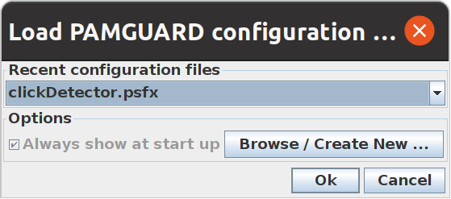
</p>

First, browse the menu bar and select `File->Add Modules->Sound Processing->Sound Acquisition`, in order to set up your audio input module. Set the name of your `Sound Acquisition` module in the window that pops up. Then, browse the menu bar and select `Settings->Sound Acquisition...`, in order to adjust the setting of your sound acquisition module. In the window that pops up, select `Audio File` as the `Data Source Type` and browse to select the audio file that you want to perform the detection for. Notice how the sample rate is automatically set to the recording sample rate.

<p align='left'>
    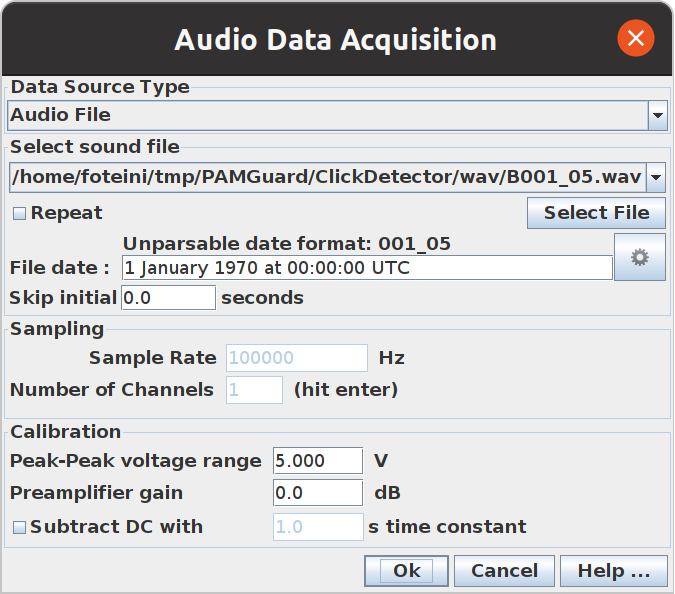
</p>

Next, browse the menu bar and select `File->Add Modules->Detectors->Click Detector`, in order to create the `Click Detector` module. Set the name of your `Click Detector` in the window that pops up. Browse the menu bar and select `Settings->Click Detector->Detection parameters...`, in order to set the parameters that define the function of the detector. In the window that pops up, set the source of the `Click Detector` module as the output of the `Sound Acquisition` module and set the values for the parameters that define the trigger events for click detection ($Long filter \sim {\alpha}_{N}$ for no click regions, $Long filter 2  \sim {\alpha}_{N}$ for click regions, $Short filter \sim {\alpha}_{S}$), as well as for the parameters that define the maximum length of each click and the minimum distance between clicks.

<p align='left'>
    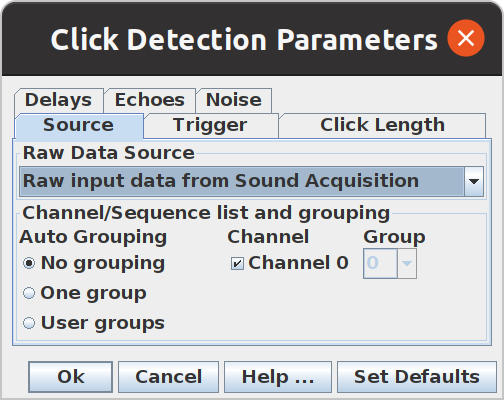
    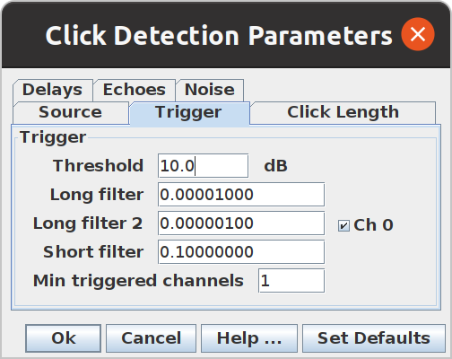
    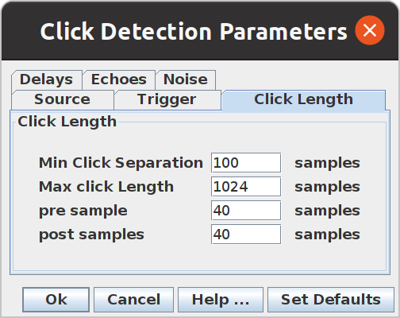
</p>

Then, browse the menu bar and select `Settings->Click Detector->Digital pre filter...`, in order to set the features of the detector pre-filter and `Settings->Click Detector->Digital trigger filter...`, in order to set the features of the detector trigger filter. Both filters were selected as high pass with a cutoff frequency of $1kHz$, so that the low frequency ship noise is discarded, while making sure that all of the click frequency content is maintained. The trigger filter was not selected as band pass, since the highest detected frequency of $50kHz$ (i.e. half of the sample rate $100kHz$) is surpassed by the highest possible frequency for click detection, which is over $100kHz$. The order of the filters was set to the default value, i.e. $4$ for the pre filter and $2$ for the trigger filter. Moreover, notice how the pole-zero and gain plots of each filter are displayed.

<p align='left'>
    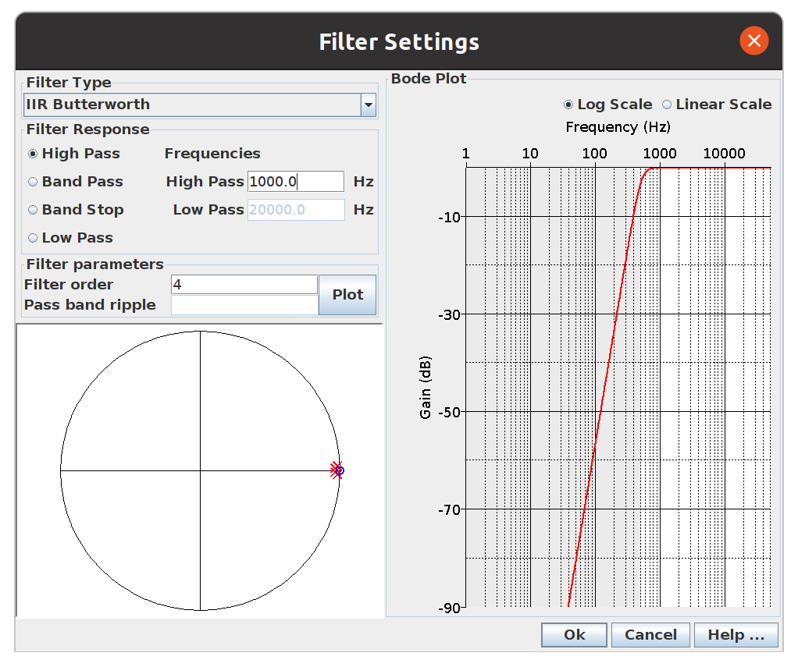
    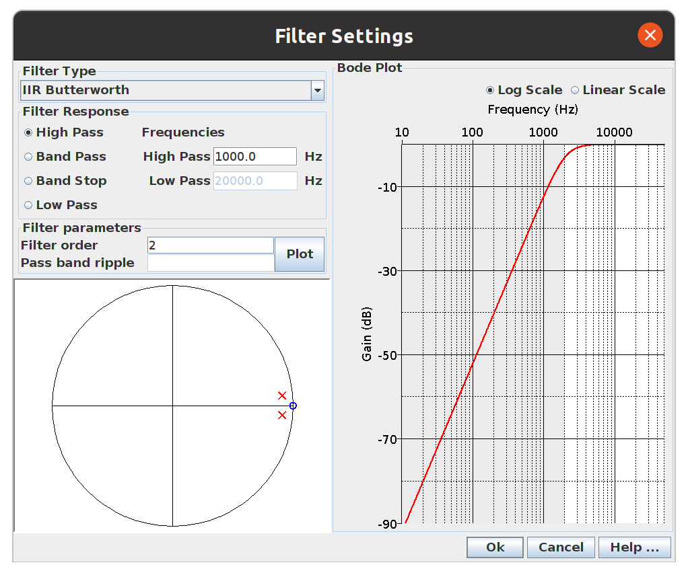
</p>

Now that the parameters that define the detection process of the `Click Detector` module have been defined, the detection can be executed and the results displayed in the `Click Detector` main display. Right click on the main display, select `Settings` and for `Axis layout` select the `Amplitude` option. Moreover, set the amplitude range from $100dB$ to $200dB$.

<p align='left'>
    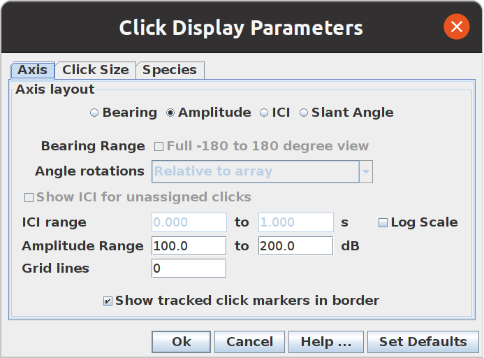
</p>

Run PAMGuard to start the detection process. At each time point that a click is detected, it is marked as a small elipse on the corresponding amplitude of the main plot. Moreover, the waveform of the signal, the signal's spectrum and the decaying histogram of the trigger are displayed.

<p align='left'>
    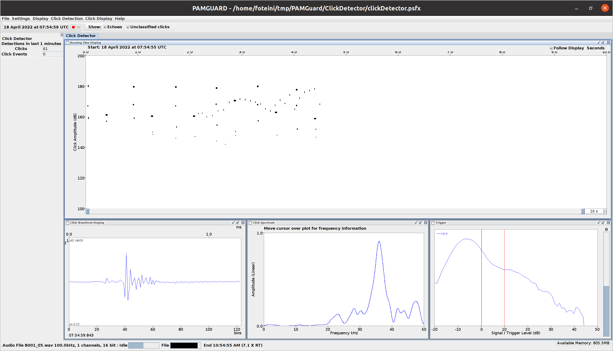
</p>

The data model of the `Click Detector` project is as follows:

<p align='left'>
    
</p>

References:
1. https://www.pamguard.org/cms/files/pamguard_training_tutorial_v1_4_05_sep2020.pdf, EX 3, pages 10-15
2. PAMGuard help pages for the Click Detector. 

### **Whistle and Moan Detector**

**Overview**

The `Whiste and Moan Detector` PAMGuard plug-in is utilized for the detection of odontocete whistles in bioacoustic signals, via the detection of whistle contours in the spectrogram image of the signal. This is achieved via the processing of the signal in the following series of steps (1-6):

**1. Remove loud clicks from the signal.**

Removing the clicks from the original signal $s$ transforms it into a new declicked signal $s'$. The clicks are removed before the FFT is computed for each signal section, e.g. for 512 sample batches if 512 point FFT is being used. At sample $i$, the declicked signal ${s}'_i$ is computed as the product of the original signal $s_i$ with a weight factor $w_i$. The weight factor $w_i$ is computed with respect to the mean value $m$ and the standard deviation $SD$ of the overall signal and parametrized according to $thresh$ and $power$, so that the signal samples that correspond to very high amplitude relative to the overall signal amplitude (i.e. clicks) are suppressed. The default values for $thresh$ and $power$ are $thresh=5$ and $power=6$. For small signals $s_i - m \ll thresh$, $w_i \approx 1$ and ${s}'_i \approx s_i$. For large signals $s_i - m \gg thresh$, $w_i \rightarrow 0$ as $thresh \rightarrow 0$ and $power \rightarrow \infty$.

$$
{s}'_i = s_i \cdot w_i \\
w_i = \frac{1}{1+(\frac{s_i-m}{thresh \times SD})^{power}}
$$

- **Remark 1**: When the deviation of the signal $s$ at sample $i$, i.e. $s_i$, from the mean value of the overall signal $m$ is greater than $thresh$, then $s_i$ is detected as a click. The $thresh$ parameter models the click detection sensitivity (low values for $thresh$ detect/suppress more clicks).

- **Remark 2**: The $power$ parameter is assigned only even values, to ensure that $0 < w_i < 1$. The greater the value for $power$ the greater the suppression of the signal. Experiment with value pairs for $thresh$ and $power$ that sufficiently suppress loud samples (clicks) without affecting too much the rest of the signal.

**2. Compute the spectrogram of the declicked signal.**
   
The spectrogram $y$ of the declicked signal $s'$ is computed by computing the FFT of $s'$ for sample batches with respect to a sliding window (i.e. the [STFT](https://en.wikipedia.org/wiki/Short-time_Fourier_transform) of $s'$ is computed). The sample size of the window (e.g. $1024$ samples) and the sample size of the slide (e.g. $50\%$ or $512$ samples) are parameters that can be adjusted, in order to adjust the time and frequency resolution of the spectrogram.

- **Remark 1**: A wide window gives better frequency resolution but poor time resolution and vice versa, i.e. there is a tradeoff between frequency and time resolution.

- **Remark 2**: A small slide gives better resolution, both in frequency and in time, but requires greater processing time, i.e. there is a tradeoff between resolution and cost. Adjust these parameters so that they optimally fit your data/signal features and your application needs.

**3. Denoise the computed spectrogram.**

After the spectrogram $y$ of the declicked signal $s'$ is computed, it is denoised via the application of $3$ noise removal algorithms; a median filter, an average subtraction and a Gaussian smoothing.

- The **median filter** flattens the spectrum across the entire frequency range by subtracting the median value of the spectrogram as computed in a frequency neighborhood around a central frequency bin $f$ from the given central frequency $y_f$. This process is performed for each frequency bin $f$ in the decibel scale spectrogram $ly$. The default value for the size of the frequency neighborhood is $61$ bins ($30$ before and $30$ after the central frequency bin $f$).

$$
ly_f = 10 \cdot \log_{10}{y_f} \\
{ly'}_f = ly_f - median(ly_{f-30}:ly_{f+30})
$$

- The **average subtraction** removes the constant tones from the spectrogram by computing a running average $b$ on each time bin $t$ and frequency bin $f$ of the original spectrogram $ly$ and then subtracting it from the median filtered spectrogram $ly'$. The running average $b$ computation is parametrized according to a weight factor $\alpha$, which models the contribution of each new time sample in the computation of the running average $b$ for a given frequency $f$. The default value for $\alpha$ is $\alpha = 0.02$.

$$
b_{t, f} = \alpha \cdot ly_{t, f} + (1-\alpha) \cdot b_{{t-1, f}} \\
{ly''}_{t, f} = {ly'}_{t, f} - b_{{t, f}}
$$

- Finally, the **Gaussian smoothing** step smooths the spectrogram by convolving it with a Gaussian kernel $G$. This process is performed on the original scale spectrogram that is produced after the average subtraction step, i.e. on $y''$.

$$
y''' = y'' * G \\
G = \begin{pmatrix}
1 & 2 & 1 \\
2 & 4 & 2 \\
1 & 2 & 1
\end{pmatrix}
$$

**4. Apply a threshold to the declicked and denoised spectrogram.**

The application of the threshold results in a two dimensional (time and frequency) binary map of the spectrogram points which are above threshold. The points that are below the threshold are set to $0$, while the points that are above the threshold maintain their value as computed in the previous step (i.e. after denoising). The default value for the theshold is $8dB$.

**5. Conduct a connected region search to link together sections of the spectrogram which are above threshold.**

In this step, the sections of the two dimensional binary map of the spectrogram that are above threshold are connected to produce larger connected regions. There exist two types of connection contact:

- the **4-connect** type assumes that two pixels connect only when they touch on their sides

- the **8-connect** type assumes that two pixels connect when they touch on their sides or on their corners.

Moreover, small regions containing less than a minimum number of pixels (default is $20$ pixels) or shorter than a minimum total length in time (default is $10$ time bins) are discarded.

**6. Separate merging, branching and crossing whistles.**

Although not necessarily a problem for the primary task of detection, whistles of different amplitude crossing complicate and impede species classification. A set of rules have been developed
to break whistles at branches, crosses or joins (collectively referred to as nodes) and to
then optionally rejoin whistles across these nodes.

**Testing the Whistle and Moan Detector**

Create a folder for your project (e.g. `WhistleDetector`) to place the files you will need for the project inside.

Create a `wav` folder inside your project folder to place the audio files for which you want to perform whistle detection.

Start PAMGuard and create a new `.psfx` file for your project.

<p align='left'>
    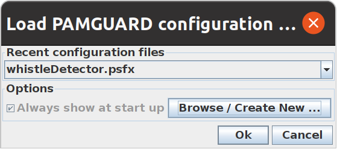
</p>

First, browse the menu bar and select `File->Add Modules->Sound Processing->Sound Acquisition`, in order to set up your audio input module. Set the name of your `Sound Acquisition` module in the window that pops up. Then, browse the menu bar and select `Settings->Sound Acquisition...`, in order to adjust the setting of your sound acquisition module. In the window that pops up, select `Audio File` as the `Data Source Type` and browse to select the audio file that you want to perform the detection for. Notice how the sample rate is automatically set to the recording sample rate.

<p align='left'>
    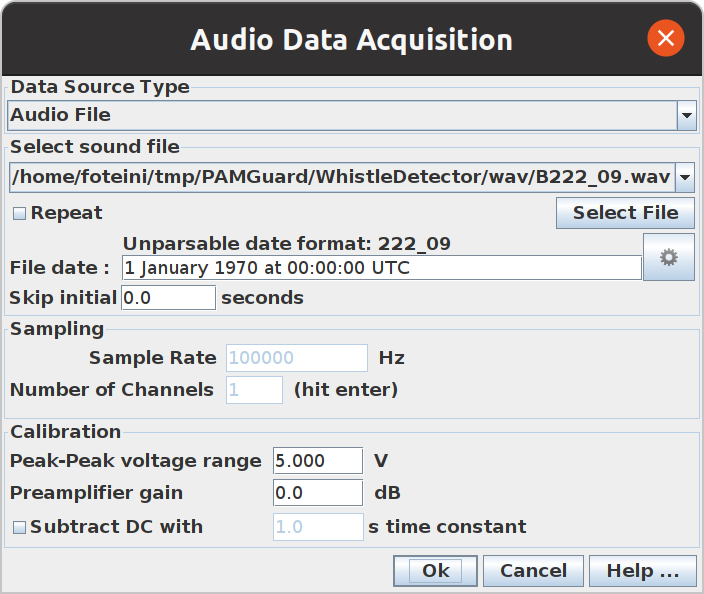
</p>

Next, browse the menu bar and select `File->Add Modules->Sound Processing->FFT (Spectrogram) Engine`, in order to set up the FFT engine for the computation of the spectrogram required by the Whistle Detector. Set the name of your `FFT (spectrogram) Engine` module in the window that pops up. Then, browse the menu bar and select `Settings->FFT (Spectrogram) Engine settings...`, in order to set the parameters of the spectrogram computation (e.g. window and slide size), as well as the parameters of the click removal and 3-step denoising described previously.

<p align='left'>
    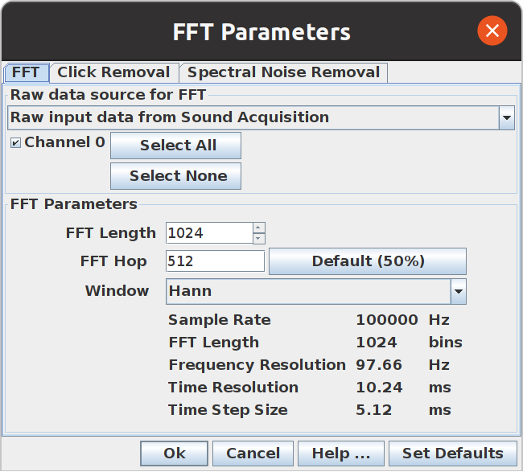
    
    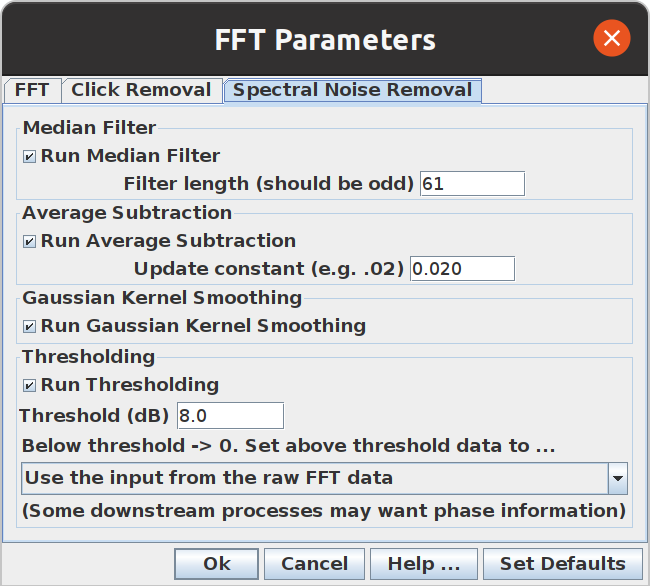
</p>

Next, browse the menu bar and select `File->Add Modules->Detectors->Whistle and Moan Detector`, in order to create the Whistle and Moan Detector. Set the name of your `Whistle and Moan Detector` in the window that pops up. Then, browse the menu bar and select `Settings->Whistle and Moan Detector`, in order to link the input of the detector to the denoised output of the FFT engine, as well as to adjust the parameters of the final steps of the Whistle Detector processing (i.e. steps 5 and 6 as described previously). Notice how you can also adjust the frequency range to be searched for whistle detection via `Min Frequency` and `Max Frequency`, which is useful when the significant frequency range of the examined signal is known and the rest of the frequency content is considered as noise (e.g. adjust frequency range so as to not consider ship noise under $1kHz$ in the detection). Don't perform the Noise and Thresholding steps here, since they have already been performed in the FFT (Spectrogram) Engine module.

<p align='left'>
    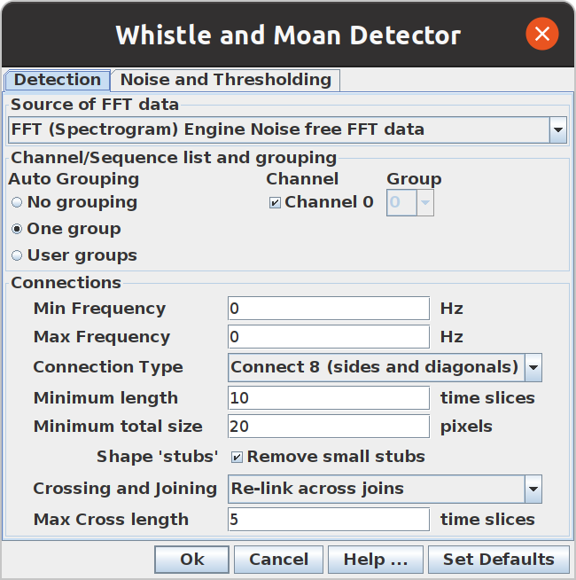
    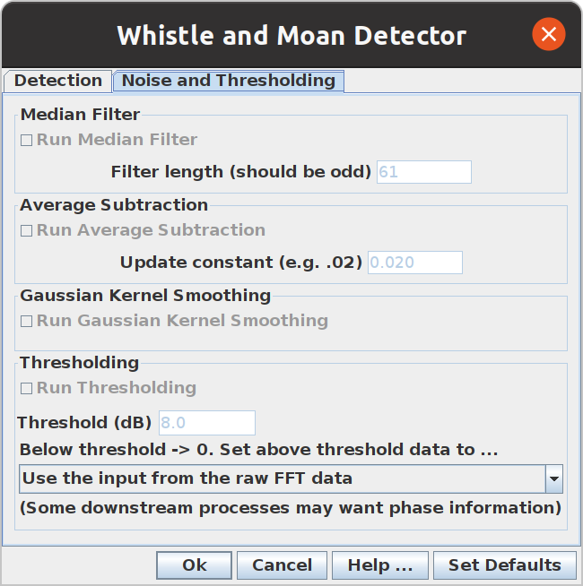
</p>

Finally, browse the menu bar and select `File->Add Modules->Displays->User display`, in order to create a display to visualize the spectrogram and the detected whistle contours. Then, browse the menu bar and select `Display->User Display->New Spectrogram Display`, in order to set up the spectrogram display. Take care to display the denoised spectrogram that is used by the Whistle Detector. Also, notice how the depicted frequency range goes up to half the recording sample rate (here $50kHz$).

<p align='left'>
    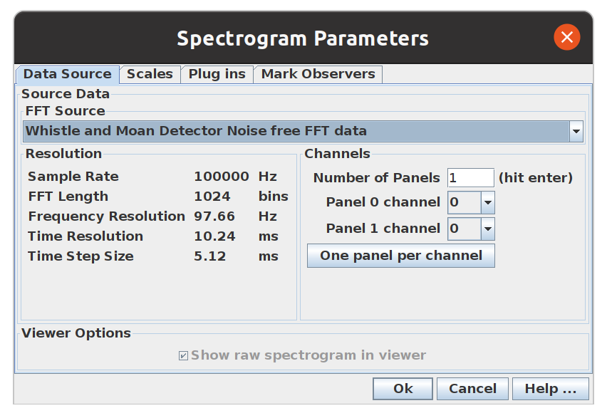
    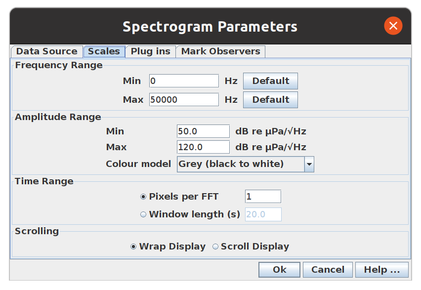
</p>

Right click on the spectrogram display and check the `Whistle and Moan Detector, Contours` option, so that the detected contours are marked in the displayed spectrogram, and run PAMGuard. The spectrograms, along with the detected contours (marked with blue color) are displayed in the following screenshots, for a binary map threshold of $8dB$, $5dB$ and $3dB$ respectively.

<p align='left'>
    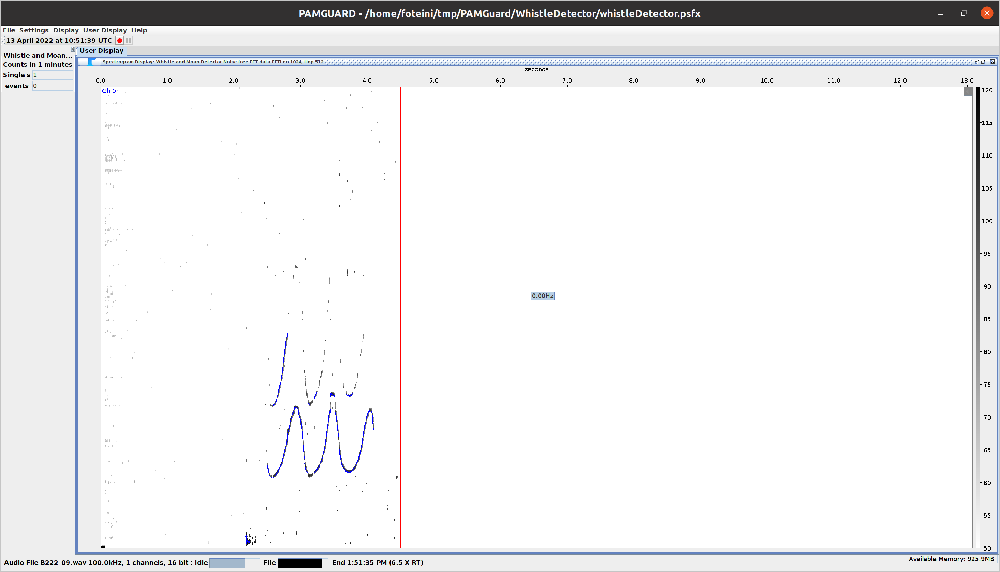
    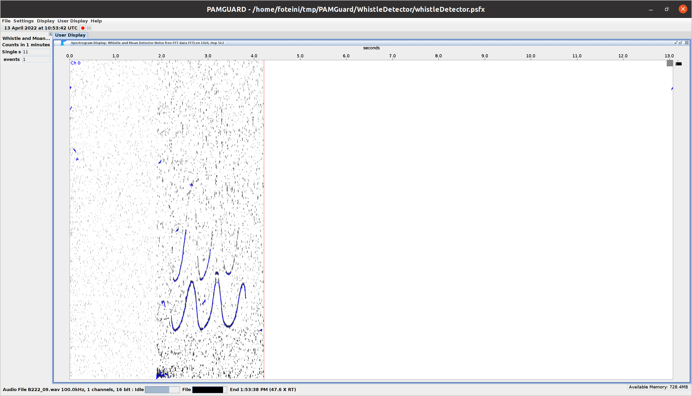
    
</p>

The data model for the described Whistle Detector project is depicted in the following screenshot.

<p align='left'>
    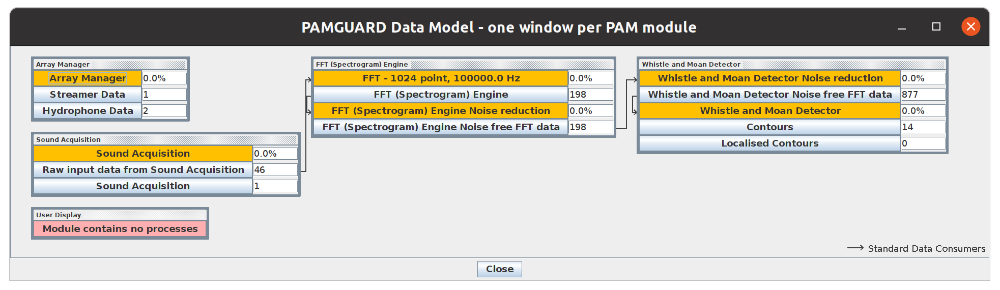
</p>

The structure of the project in the filesystem is as follows:

```
WhistleDetector/
├── wav
│   └── B222_09.wav
└── whistleDetector.psfx

1 directory, 2 files
```

References:
1. https://gisserver.intertek.com/JIP/DMS/ProjectReports/Cat4/PAMGuard/JIP-Proj4.2.9_SMRU_Odontocetes__2011.pdf, pages 9-15
2. https://www.pamguard.org/cms/files/pamguard_training_tutorial_v1_4_05_sep2020.pdf, EX 4 & 5, pages 16-24

## **Marine mammal classification with PAMGuard**

### **Whistle Classifier**

**Overview**

The `Whistle Classifier` is a PAMGuard plug-in that performs marine mammal classification according to the whistles that are detected in the corresponding recorded acoustic signals. For this purpose, it utilizes the output of the `Whistle and Moan Detector` PAMGuard plug-in, which, as described previously, processes the acoustic signal in a series of steps (1-6), in order to detect whistle contours in the spectrogram of the signal.

The final processing step of the `Whistle and Moan Detector` module manages the overlap and crossing of multiple detected contours, which is common, since more often than not marine mammals are encountered in groups. In the final step of the `Whistle and Moan Detector` module, the crossing contours are separated into segments and then optimally relinked so that the original whistles of the signal are reconstructed. However, this technique is not perfect and the resulting detected whistles may still be broken up in segments, reconstructed poorly (e.g. segments that don't belong to the same whistle are joined) and be overall compromised.

The inconsistent and compromised state of the contours detected by the `Whistle and Moan Detector` complicate the task of classification according to detected whistles that the `Whistle Classifier` is called to perform. The way that the `Whistle Classifier` addresses this challenge is by breaking all detected contour segments in fragments of a given constant length and performing the classification by analyzing the features of these fragments instead of whole segments.

More specifically, each detected by the `Whistle and Moan Detector` segment is broken up in fragments of a given constant size and three parameters are measured for each fragment; the mean frequency ($Hz$), the slope ($Hz/sec$) and the curvature ($Hz/sec^2$). During the training of the `Whistle Classifier`, the values of these three parameters are measured for each fragment and accumulated over time to build up distributions of these three parameters for each marine mammal class. Once sufficient fragments have been accumulated, the mean, the standard deviation and the skew of each distribution is measured, giving a total of nine parameters to be used for classification.

Assuming that the dataset consists of sample audio files that are mapped to one mammal class each, the training and testing of the classifier is performed by splitting the dataset into training and test sets (e.g. 2/3 training and 1/3 test), so that the parameter distribution is created during the training with the data from the training set and the classification is performed on the data from the test set, in order to test the performance of the classifier. This training and testing process is performed multiple times for random bootstraps of the data, in order to ensure more robust results.

- **Remark**: While the original dataset consists of raw audio files, the dataset with which the training and testing of the classifier and the classifications are performed consists of sections of fragments that are accumulated over time from the raw audio files. This means that the fragment size and the sections size (in fragments) are key parameters that greatly affect the dataset, both its size and quality.

**Testing the Whistle Classifier**

Create a folder for your project (e.g. `WhistleClassifier`).

Create a `wav` folder inside your project folder and place the audio files of the mammal recordings to be classified inside. Take care to organize the files in subfolders with respect to the species, e.g. create a `SW` subfolder to place the sperm whale audio recordings inside and create a `SD` subfolder to place the striped dolphin audio recordings inside.

The `Whistle Classifier` module requires the output of the `Whistle and Moan Detector`. Copy the `.psfx` file of the previous Whistle Detector project into your current project folder, in order to automatically load and set up the `Whistle Classifier` prerequired modules. Give the `.psfx` file a name that is indicative for the current project (e.g. `whistleClassifier.psfx`).

<p align='left'>
    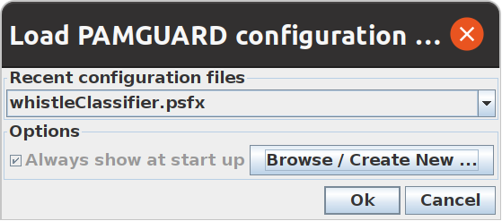
</p>

The initial project structure in the filesystem should look like this:

```
WhistleClassifier/
├── wav
│   ├── SD [347 entries exceeds filelimit, not opening dir]
│   └── SW [184 entries exceeds filelimit, not opening dir]
└── whistleClassifier.psfx

3 directories, 1 file

```

Notice how there exist $347$ recordings of striped dolphins and $184$ recordings of sperm whales.

Start PAMGuard and load your project `.psfx` file. Browse to `File->Show Data Model...` to open the data model window. Initially, the data model should look like the one displayed for the Whistle Detector project, i.e. it should contain a `Sound Acquisition` module linked to an `FFT (Spectrogram) Engine` module, which in turn is linked to a `Whistle and Moan Detector` module.

Right click on the `Sound Acquisition` module to open its settings, in order to specify the folder where the audio files to be classified reside (i.e. the `wav` folder).

<p align='left'>
    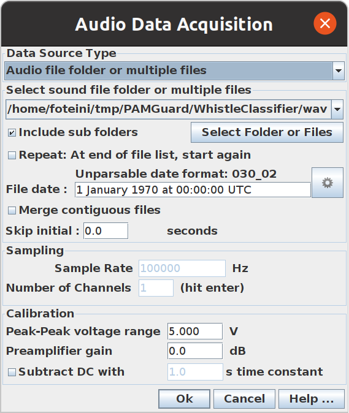
</p>

Browse the menu bar and select `File->Add Modules->Classifiers->Whistle Classifier` to create your `Whistle Classifier` module. Set the name of your `Whistle Classifier` module in the window that pops up.

Browse the menu bar, select `Settings->Whistle Classifier->Settings...` and in the window that pops up select the `Collect training data` option, in order to setup the `Whistle Classifier` for the collection of training data step, i.e. for the detection of whistle contours by the `Whistle and Moan Detector` and the extraction of the detected contours for each audio file. Check the `Use folder names for species` option, in order to infere the species labels for the audio files via their organinzation in subfolders (i.e. `SD` and `SW`). The detected contours are stored in a separate `.wctd` (whistle classifier training data) file for each audio file, along with the species that the audio file corresponds to. Browse to select the storage folder for the training data.

<p align='left'>
    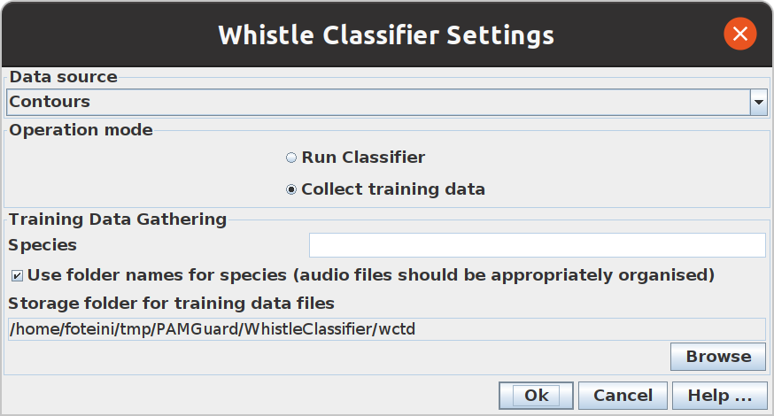
</p>

Run PAMGuard to start the training data collection process. This will take some time, since all the audio files are being processed for contour detection and extraction by the `Whistle and Moan Detector`. Once the processing is done, the project structure in the filesystem should look like this:

```
WhistleClassifier/
├── wav
│   ├── SD [347 entries exceeds filelimit, not opening dir]
│   └── SW [184 entries exceeds filelimit, not opening dir]
├── wctd [531 entries exceeds filelimit, not opening dir]
└── whistleClassifier.psfx

4 directories, 1 file
```

Notice how, one `.wctd` file has been created for each audio file ($347+184=531$).

Moreover, the `Whistle Classifier` module is added to the data model, linked to the `Whistle and Moan Detector` module.

<p align='left'>
    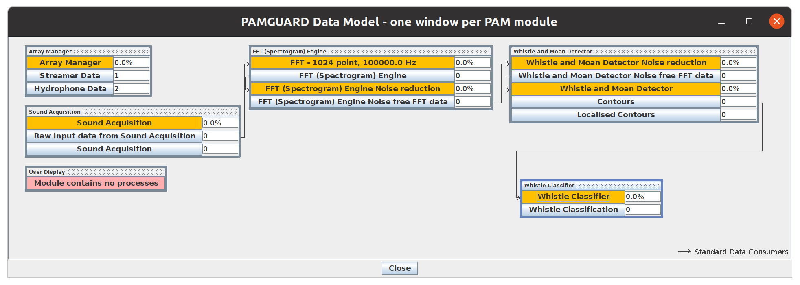
</p>

Now, browse the menu bar and select `Settings->Whistle Classifier->Discriminant function training...`, in order to set up your `Whislte Classifier` module for training. In the window that pops up, make sure that the `Training data source` points to the folder where the `.wctd` files reside. Note also that you can filter the detected contours to be considered during training by adjusting the explored frequency range and the minimum contour duration in time bins.

<p align='left'>
    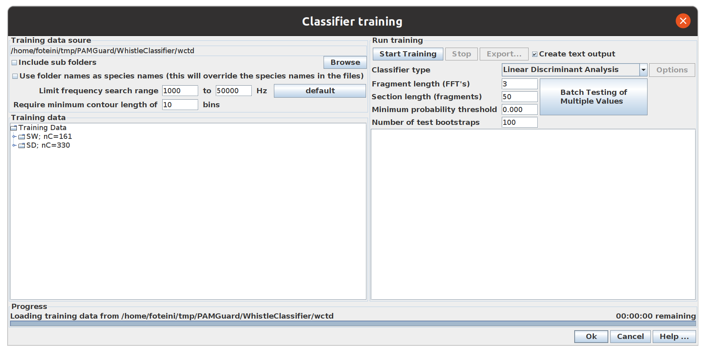
</p>

This is the step where the values for the classifier parameters are specified. The classifier parameters are the following:

- the **classifier type**, either Linear Discriminant Analysis, Mahalanobis Distance Classifier, Random Forest or Regression Tree (default is Linear Discriminant Analysis)
- the **constant fragment length** (in FFT bins) that is used for the fragmentation of the detected whistle contour segments (default value is $8$)
- the **constant section length** (in fragments) that defines the number of fragments to be accumulated before the statistical analysis and classification is performed (default value is $150$)
- a **minimum probability threshold** that the species assigned probability has to overcome in order for the classification of the section to be performed (default is $0$)
- the **number of test bootstraps** to be performed (default is $30$)

Select `Start Training` in order to run the training step. Before executing training, check the `Create text output` option if you want the training execution and outcome to be summarized in a `.txt` file. The outcome of the training is summarized in confusion matrices that statistically describe the correlation of the classification labels to the original target labels on all bootraps.

Here, the best results were acquired for fragment length equal to $3$, section length equal to $50$ and number of boostraps equal to $100$. The rest of the classifier parameters were assigned their default values. Moreover, the frequencies below $1kHz$ were excluded from the frequency range explored in the classifier and the whistle detection was performed with the default values for the parameters of the `Whistle and Moan Detectro Module`.

The mean of the classification and target labels confusion matrix, as inferred from the $100$ executed during training bootstraps, is as follows:

|           | **SW**    | **SD**    |
| :----:    | :----:    | :----:    |
| **SW**    | 0.6400    | 0.3600    |
| **SD**    | 0.2636    | 0.7364    |

Striped dolphins were classified correctly with a mean rate of $64\%$, while sperm whales were classified correctly with a mean rate of $74\%$. More errors are due to the misclassification of sperm whales as striped dolphins ($0.36\%$) than the misclassification of striped dolphins as sperm whales ($0.26\%$).

The standard deviation of the classification and target labels confusion matrix, as inferred from the $100$ executed during training bootstraps, is as follows:

|           | **SW**    | **SD**    |
| :----:    | :----:    | :----:    |
| **SW**    | 0.1935    | 0.1935    |
| **SD**    | 0.1736    | 0.1736    |

Notice how there exists considerable deviation between the $100$ confusion matrices, approximately $20\%$. This means that the mean percentages of right classification presented in the previous matrix could in some cases be reduced by approximately $20\%$ for each species ($44.65$ right classification of sperm whales and $56.28$ right classification of striped dolphins).

The trained classifier is already loaded in the project configurations. Select the `Export` option if you want to save the trained classifier in a `.wcsd`, in order to share it or load it at a later time.

Now that the classifier is trained, it can be used for classification. The `Whistle Classifier` performs marine mammal classification for time section of one given audio file. Here, the audio file that the classification was performed for is a $2389sec$ long random order concatenation of the audio files that were used during training. Browse the menu bar and select `Settings->Sound Acquisition...`, in order to change the source of data input to the single audio file that the classification will be performed for.

<p align='left'>
    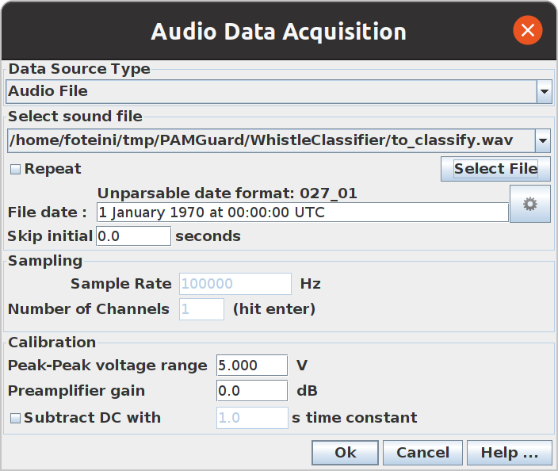
</p>

Browse the menu bar, select `Settings->Whistle Classifier->Settings...` and in the window that pops up select the `Run classification` option as `Operation Mode`. There exists an option to load a previously trained classifier via its `.wcsd` file. Moreover, the values of the parameters that the classifier was trained for are displayed.

<p align='left'>
    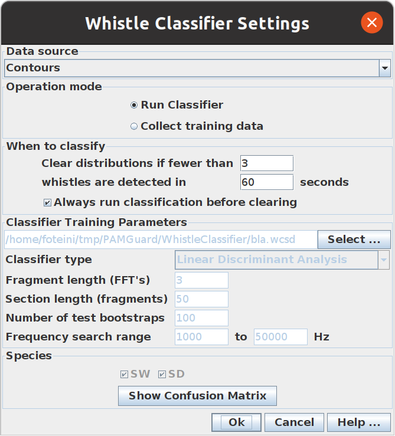
</p>

Run PAMGuard to start the classification process. During the classification, the audio file is processed in the same manner as the training set audio files were processed in during training, i.e. the segments detected by the `Whistle and Moan Detector` are split into fragments of given length (here $3$ FFT bins) and the fragments are accumulated to sections of given length (here $50$ fragments), for which the statistical analysis and classification is performed. The output of the classification is displayed in the main `Whistle Classifier` display and consists of three histograms, one for each fragment parameter (mean frequency, frequency slope and frequency curvature), as well as a plot of the probability that the classifier predicts through the recording for each species.

<p align='left'>
    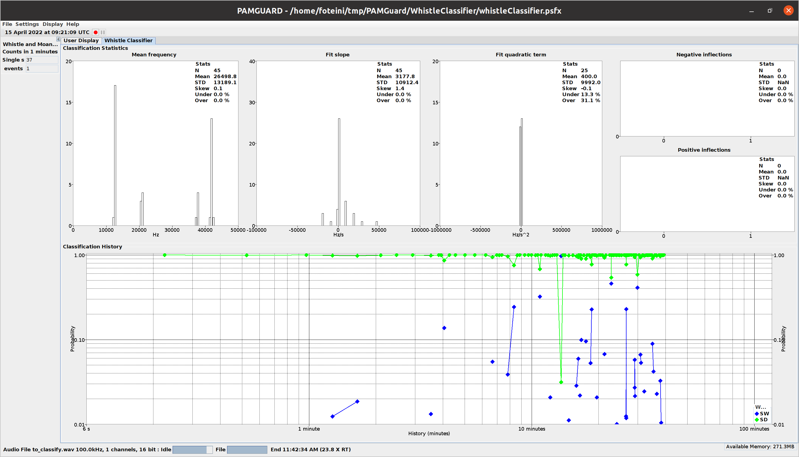
</p>

Notice how the classifier mainly predicts the striped dolphin species (green color). This is because features of detected whistles are used for the classification, but no whistles are present in the sperm whale (blue color) recording. In fact, the detected whistle contours are very few even for the striped dolphin recordings. The small number of whistles in the dataset recordings is also reflected by the small number of samples used in the fragment parameter histograms.

- **Remark 1**: Striped dolphin recordings contain whistles, while sperm whale recordings don't. This fact limits the ability of the `Whistle Classifier` to perform correct classification for sperm whale recordings. This challenge could be addressed by increasing the value for the minimum probability threshold training parameter, so that the samples that are predicted as striped dolphins with low probability remain unclassified. Then, the unclassified samples can be assumed to belong to the sperm whale species.
   
- **Remark 2**: The overall detected whistles in our dataset recordings are very few, which again impedes the performance of the `Whistle Classifier` PAMGuard module. In order to utilize the few detected whistles the best way possible for the dataset size increase, the detected contours are split in very small fragments that are in turn accumulated in short sections. However, splitting the `Whistle and Moan Detector` segments in too small fragments may cause some key contour features, e.g. the contour curvature, to be lost, while processing too small fragment sections may lead to inadequate statistical analysis and classification. This means that there exists an overall tradeoff between the quality and the size of the dataset, as affected by the values for the constant fragment size and constant section size training parameters. 
  
- **Remark 3**: The key parameters of the `Whistle Classifier`, such as the minimum probability threshold (see Remark 1), the fragment and section sizes (see Remark 2), the classifier type, the number of test bootstraps, etc., as well as the parameters of the previous steps, e.g. the `FFT (spectrogram) Engine` declicking and denoising parameters, need to be explored together, so that they are tuned for the optimal performance of the `Whistle Classifier` on our data.

References:
1. https://gisserver.intertek.com/JIP/DMS/ProjectReports/Cat4/PAMGuard/JIP-Proj4.2.9_SMRU_Odontocetes__2011.pdf, pages 15-27

### **Click Classifier**

**Overview**

The `Click Classifier` is available as a feature of the `Click Detector` PAMGuard module that was presented previously. It is used for classification of marine mammals according to the features of the detected clicks in their audio recordings. More specifically, a set of $6$ parameters are extracted from both the click waveform and the click spectrum for all audio recordings in a species labeled dataset. A methodology similar to the one used in the `Whistle Classifier` is utilized for the estimation of the distribution of these $6$ parameters for each dataset species and the classification of each audio sample to the species whose distribution it best matches.

- **Remark**: Each detected click has the role that a section of fragments has in the `Whistle Classifier`, i.e. the dataset with which the `Click Classifier` is trained consists of click samples and not raw audio files. Typically, a number of detected clicks is derived from one single audio recording.

The $6$ waveform and spectrum parameters/features that are extracted for each click are the following:

1. The **click length**, as extracted from the click waveform.

For the computation of the length of a detected click, two time points before and after the click amplitude peak are selected, as the start time point and the end time point of the click, respectively. More specifically, the envelope of the click waveform is calculated from the waveform's Hilbert transform and, after being smoothed with a 5-point moving average filter, the two points that intersect it at a level that is $8dB$ lower than the peak amplitude are selected as the start and end time points of the click, respectively. Then, the click length is computed by subtracting the value for the start time point from the value for the end time point.

2. The **number of zero crossings**, as extracted from the click waveform.
   
The number of zero crossings of the click is computed as the number of times that the amplitude of the click waveform is equal to $0$ between the time points that define the start and the end of the click, which are computed according to the envelope intersection method that was described previously.

3. The **frequency sweep**, as extracted from the click waveform.

The frequency between two zero crossing time points, i.e. two time points for which the amplitude of the click waveform is equal to $0$, is estimated as $f = \frac{1}{2T_Z}$, where $T_Z$ is the distance between the two time points. The frequency sweep of the click is computed as the linear fit of the frequency estimates for each pair of consecutive zero crossing time points, i.e. for each pair of zero crossing time points between which no zero crossing exists.

4. The **peak frequency**, as extracted from the click spectrum.

5. The **mean frequency**, as extracted from the click spectrum.

6. The **peak width**, as extracted from the click spectrum.

- **Remark**: The `Click Classifier` is pretrained for two separate species, beaked whale and porpoise. The actual training for the per species derivation of the click parameter distributions is not included as a PAMGuard functionality. This process is executed separately by the user and the results are integrated to the `Click Classifier` by setting the parameter value ranges for each species/type to be considered during the classification process.

The histograms for the click parameter values of the sperm whale recordings are displayed on the left figure, while the histograms for the click parameter values of the striped dolphin recordings are displayed on the right figure.

<p align='left'>
    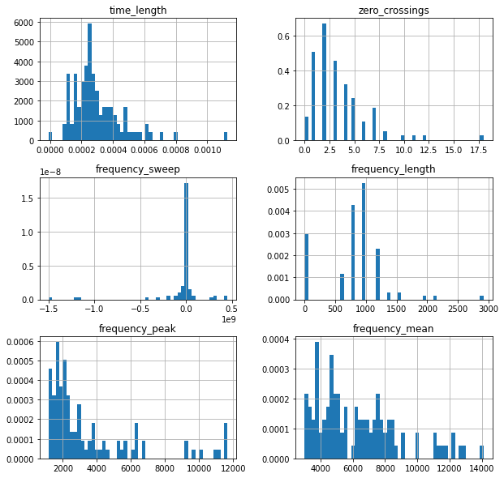
    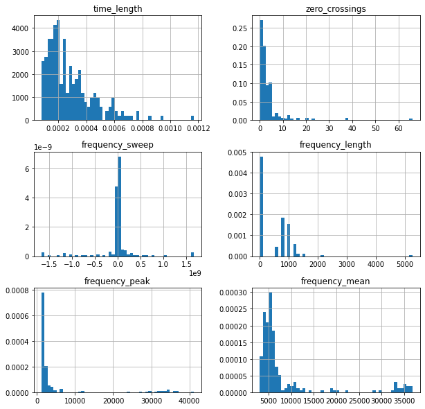
</p>

**Testing the Click Classifier**

Create a folder for your project (e.g. `ClickClassifier`).

Create a `wav` folder inside your project folder and place the audio files of the mammal recordings to be classified inside.

The `Click Classifier` is offered as a functionality of the `Click Detector` module. Copy the `.psfx` file of the previous Click Detector project into your current project folder, in order to automatically load and set up the `Click Classifier` prerequired modules. Give the `.psfx` file a name that is indicative for the current project (e.g. `clickClassifier.psfx`).

<p align='left'>
    
</p>

Start PAMGuard and load your project `.psfx` file. Browse to `File->Show Data Model...` to open the data model window. The data model should look like the one displayed for the Click Detector project, i.e. it should contain a `Sound Acquisition` module linked to a `Click Detector` module.

Right click on the `Sound Acquisition` module to open its settings, in order to specify the file for which the classification will be performed.

<p align='left'>
    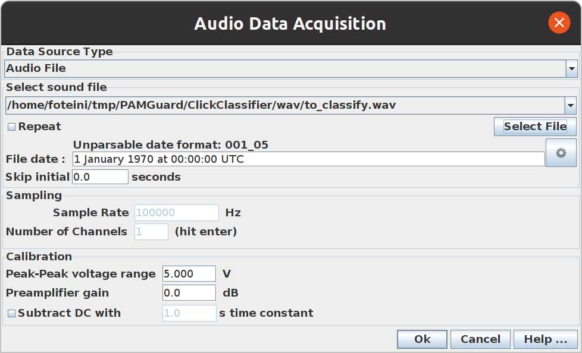
</p>

Browse the menu bar and select `Click Detection->Click Classification...`, in order to set the parameters that decide the classification process, i.e. the parameter value ranges per classification species/type.

In the window that pops up, select the `Classifier with frequency sweep` as the `Click Classifier` and check the option `Run classification online`.

<p align='left'>
    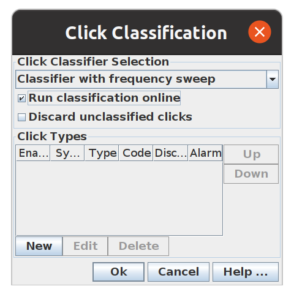
</p>

Then select `New`, in order to set the parameters for the sperm whale (SW) classifier.

<p align='left'>
    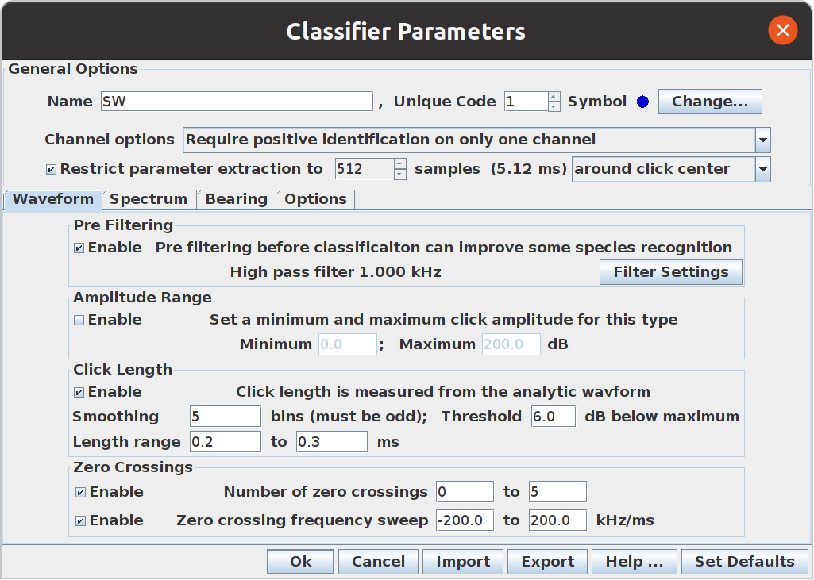
    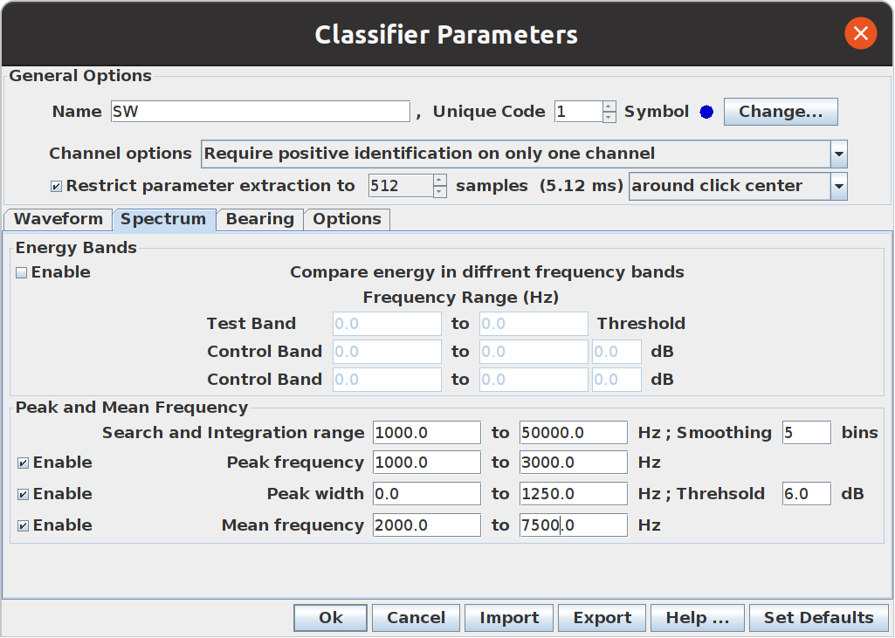
</p>

Now, select `New` and do the same to set the striped dolphin (SD) classifier.

<p align='left'>
    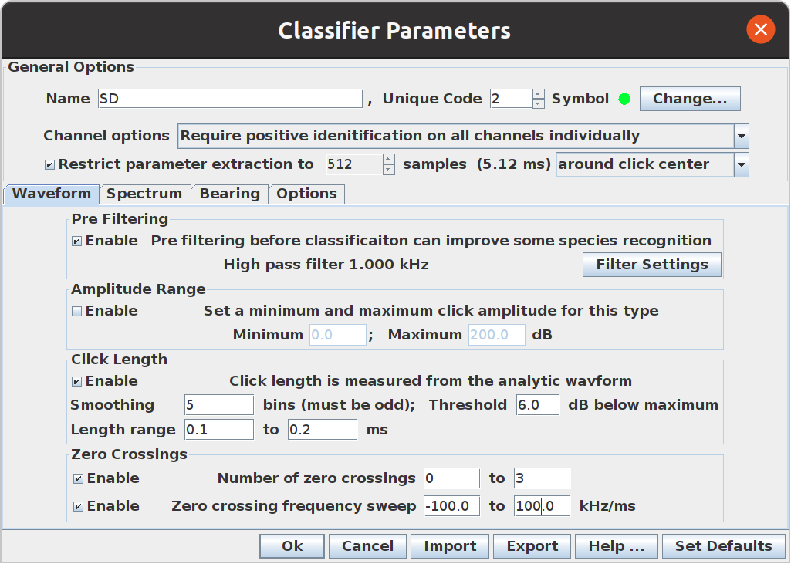
    
</p>

Enable both type/classifiers and click `Ok` to close the dialogue.

<p align='left'>
    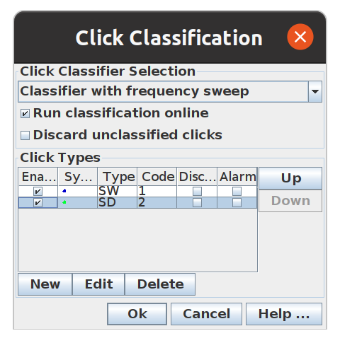
</p>

References:
1. https://gisserver.intertek.com/JIP/DMS/ProjectReports/Cat4/PAMGuard/JIP-Proj4.2.9_SMRU_Odontocetes__2011.pdf, pages 27-37